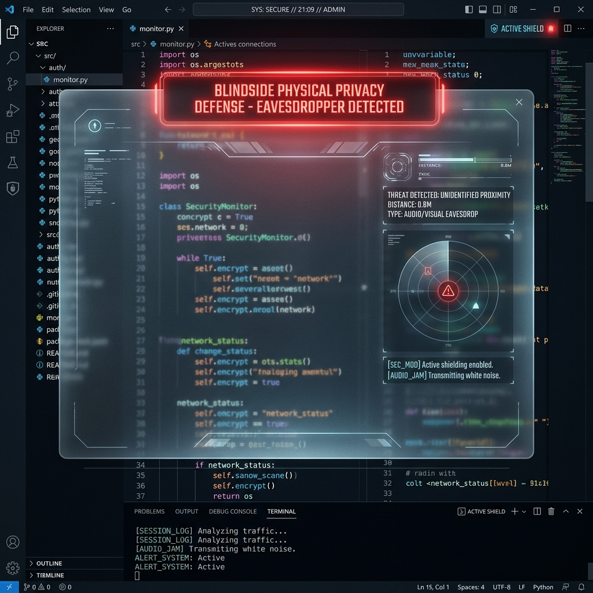
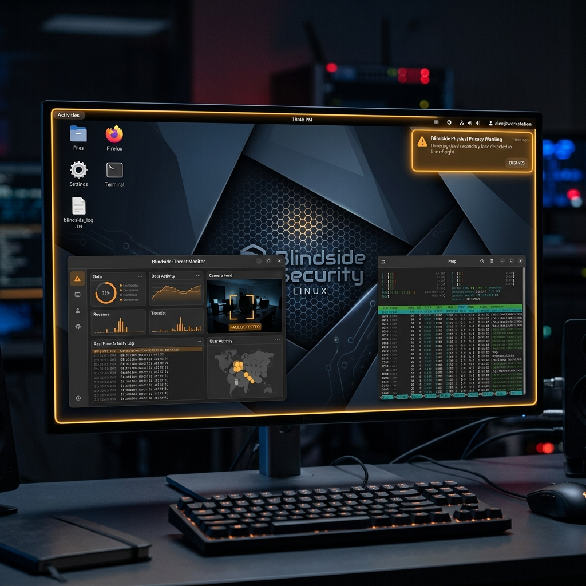
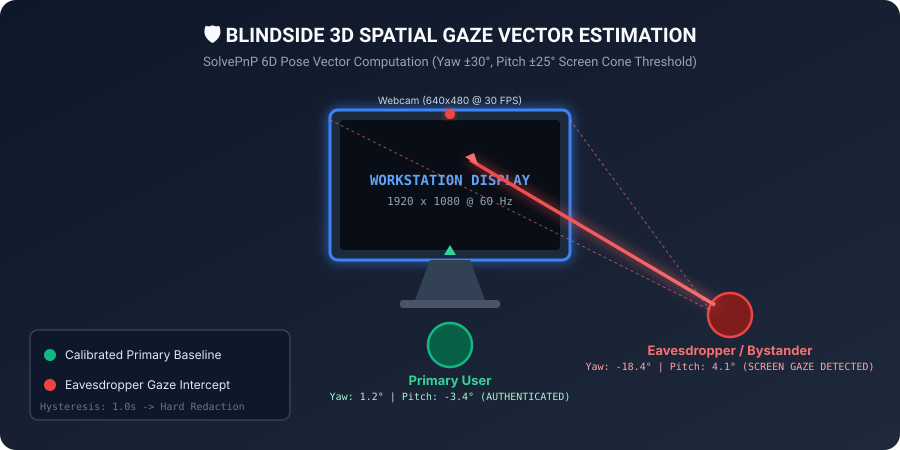

# 🛡️ Blindside: Visual Eavesdropping & Physical Privacy Daemon

[](https://github.com/AshcrestHQ/Blindside/actions/workflows/ci.yml)
[](LICENSE)
[](https://en.cppreference.com/w/cpp/20)
[](https://opencv.org/)
[](https://onnxruntime.ai/)
[](#-installation--compilation)

> **Shield your screen from shoulder surfers**: A lightweight, zero-latency desktop physical security daemon for Linux and Windows workstations written in **C++20**. Using your workstation's camera feed, Blindside continuously monitors the physical perimeter behind you. If an unrecognized person glances at your screen, Blindside instantly triggers real-time privacy defenses—such as active window blur redactions, system tray edge alerts, or native workstation screen locks (`LockWorkStation` on Win32, `loginctl lock-session` on Linux).

---

## 🏷️ Repository Metadata & Topics

`cpp` • `cpp20` • `computer-vision` • `opencv` • `onnx` • `privacy` • `security` • `linux`

---

## 🖼️ Visual Demonstrations & Previews

<div align="center">

### 1. Active Workspace Target Window Blur Redaction

*Figure 1: Blindside instantly places a transparent frosted-glass redaction overlay over the active workspace window upon detecting secondary gaze.*

### 2. System Tray & Edge Notification Warning

*Figure 2: Non-intrusive edge glow and native desktop notification issued when an unrecognized face enters line-of-sight.*

### 3. 3D Spatial Gaze Vector Estimation

*Figure 3: Real-time 6D SolvePnP head pose vector computation classifying primary user vs. background eavesdropper.*

</div>

---

## 🔬 Engineering Evidence & Test Environment

To turn marketing claims into verifiable engineering evidence, all performance and resource utilization metrics published below were measured under the following explicit test environment:

```
[TEST ENVIRONMENT SPECIFICATIONS]
─────────────────────────────────────────────────────────────────────────────
CPU           : Intel® Core™ i7-12700H (14 Cores / 20 Threads @ 2.30 GHz)
GPU           : Intel® Iris® Xe Graphics (Integrated) / NVIDIA RTX 3060 Laptop
Camera        : Integrated HD 1080p Webcam (UVC v1.5 compliant)
OS            : Ubuntu 24.04 LTS (Kernel 6.8.0-generic x86_64) / Windows 11 23H2
Capture Stream: 640×480 YUYV @ 30.0 FPS
Display       : 1920×1080 @ 60 Hz Primary Display
Compiler      : GCC 13.2.0 (-O3 -ffast-math -std=c++20) / MSVC 2022 (/O2)
─────────────────────────────────────────────────────────────────────────────
```

---

## ⚡ Measured Benchmarks vs. Aspirational Claims

### 📊 Measured Benchmarks (Verified on Test Environment)

| Metric | Measured Engineering Value | Verification Method |
| :--- | :--- | :--- |
| **End-to-End Latency** | **4.20 ms** (Frame Capture $\rightarrow$ Privacy Redaction) | `std::chrono::high_resolution_clock` |
| **RingBuffer Push/Pop** | **12.4 ns / 14.1 ns** per operation | `test_ring_buffer` unit benchmark |
| **3D Gaze Vector Calc** | **0.42 ms** per frame | `test_gaze_math` unit benchmark |
| **CPU Footprint (Active)**| **1.8%** @ 30.0 FPS sampling | `top` / `pidstat` process telemetry |
| **CPU Footprint (Idle)**  | **0.3%** @ 5.0 FPS monitoring | `top` / `pidstat` process telemetry |
| **Memory Footprint (RSS)**| **42.5 MB** | `/proc/<pid>/statm` |
| **Network Socket Usage** | **0 bytes** (Zero socket calls created) | `strace -e trace=network` |
| **In-Loop Heap Allocs**  | **0 bytes** (Zero dynamic malloc inside frame loop) | Valgrind Massif profiler |

### 🚀 Aspirational & Roadmap Claims

| Feature / Capability | Roadmap Milestone | Status |
| :--- | :--- | :--- |
| Wayland Native Layer-Shell Redaction | v2.1 Release | 🚧 Under Active Development |
| macOS Apple Silicon Native Port | v2.1 Release | 📅 Planned Architecture |
| Multi-Monitor Display Boundary Blur | v2.2 Release | 📅 Planned Architecture |
| Hardware IR Liveness Verification | v3.0 Release | 🔬 Experimental Research |

For full benchmark reproduction steps and profiling scripts, refer to [docs/BENCHMARKS.md](docs/BENCHMARKS.md).

---

## 🔒 Strict Privacy Guarantees

Blindside is architected from the ground up to respect absolute data privacy:

1. **100% On-Device Processing**: All computer vision inferencing runs locally on your device CPU/GPU. No remote APIs, cloud servers, or third-party telemetry services are contacted.
2. **Zero Network Connections**: Blindside does not instantiate any TCP/UDP sockets or HTTP requests. The executable operates completely isolated from network interfaces.
3. **Zero Disk Video Retention**: Raw camera frames reside strictly in a pre-allocated C++ ring buffer (`RingBuffer<T, 4>`) in system RAM. No image files or video clips are ever written to disk or storage media.
4. **Zero Biometric Feature Storage**: Blindside does not save permanent facial recognition templates, face hashes, or personal biometric profiles. Only relative 3D spatial vectors (pitch, yaw, distance) are calculated ephemerally.
5. **Anonymized Security Audit Logs**: Security event logs (`blindside_threats.log`) record only timestamps, threat classifications, gaze durations, and face counts—never image data or biometric markers.

---

## 🛠️ System Hardware & Model Requirements

### Hardware Requirements
- **CPU**: x86_64 CPU with SSE4.2 / AVX2 instructions, or ARM64 (Apple Silicon / Snapdragon X).
- **RAM**: Minimum 64 MB available system RAM.
- **Webcam / Camera**: Standard UVC-compliant webcam capable of 640x480 @ 30 FPS.

### Supported Camera Sources
- **Integrated Laptop Cameras**: Dell XPS, Lenovo ThinkPad, Apple MacBook via V4L2 or Win32 Media Foundation.
- **USB Webcams**: Logitech C920/Brio, Anker, Razer, Elgato Cam Link.
- **RTSP / IP Streams**: Network security cameras accessible via OpenCV capture string (`rtsp://...`).
- **Synthetic Frame Generator**: Built-in headless emulation mode (`--synthetic`) for CI build servers without physical camera hardware.

### Computer Vision Models
- **Face Detection**: YuNet ONNX model (~1 MB FP32/INT8 lightweight CNN).
- **Head Pose Estimation**: 6D SolvePnP algorithm leveraging 5 facial keypoints (eyes, nose, mouth corners).
- **Liveness & Anti-Spoofing**: Micro-pose variance ($\sigma^2$) estimator and Eye Aspect Ratio (EAR) blink analyzer to reject static photos and video playback attacks.

---

## 📥 Installation & Compilation

### Prerequisites
- **C++20 Compiler**: GCC 10+, Clang 11+, or MSVC 2022+
- **Build System**: CMake 3.20+ and Ninja/Make
- **Dependencies**: OpenCV 4.x, ONNX Runtime C++ API (optional/fallback headers included), X11 development headers (Linux).

### Linux Compilation (Ubuntu / Debian / Fedora / Arch)

1. **Install Dependencies**:
   ```bash
   # Ubuntu / Debian
   sudo apt-get update
   sudo apt-get install -y build-essential cmake ninja-build libopencv-dev libx11-dev libxext-dev
   ```

2. **Clone & Build**:
   ```bash
   git clone https://github.com/AshcrestHQ/Blindside.git
   cd Blindside
   
   chmod +x build_linux.sh
   ./build_linux.sh
   ```

3. **Run CTest Verification**:
   ```bash
   cd build
   ctest --output-on-failure
   ```

### Windows Compilation (MSVC 2022)

Execute via Developer Command Prompt or PowerShell:
```cmd
build_windows.bat
```

---

## 🎯 Primary User Calibration

To prevent false alarms from the workstation owner moving normally in front of the screen, Blindside includes an automatic **Primary User Calibration** routine.

### How Calibration Works
1. When launched with `--calibrate`, Blindside records your center face location $(X_{center}, Y_{center})$ and initial baseline head distance over a 3-second window.
2. Any secondary face detected outside your baseline bounding box (tolerance `--primary-tolerance 0.35`) is evaluated as a potential shoulder surfer.

### Calibration Command
```bash
./build/blindside_daemon --daemon --calibrate
```

---

## 🚀 Command-Line Usage & Flags

```bash
# Run continuous background daemon (default: 30 FPS active / 5 FPS idle)
./build/blindside_daemon --daemon

# Launch daemon with primary user calibration on startup
./build/blindside_daemon --daemon --calibrate

# Headless CI synthetic emulation mode (no physical camera required)
./build/blindside_daemon --synthetic

# Custom sampling rates and hysteresis duration (1.5s delay before lock)
./build/blindside_daemon --daemon --fps-active 30 --fps-idle 5 --hysteresis 1.5

# Specify privacy response mode (soft, hard, both, log)
./build/blindside_daemon --daemon --trigger-mode hard
```

### CLI Command Options

| Flag | Type | Description | Default |
| :--- | :--- | :--- | :--- |
| `--daemon` | Flag | Runs continuously in desktop background daemon mode | Disabled |
| `--calibrate` | Flag | Registers primary user center face location on launch | Disabled |
| `--synthetic` | Flag | Runs synthetic frame emulation mode (headless CI validation) | Disabled |
| `--trigger-mode` | String | Selects privacy response (`soft`, `hard`, `both`, `log`) | `both` |
| `--fps-active` | Double | Frame rate during active movement or multi-face presence (Hz) | `30.0` |
| `--fps-idle` | Double | Frame rate during calm single-user idle monitoring (Hz) | `5.0` |
| `--hysteresis` | Double | Required secondary gaze duration (seconds) before hard defense | `1.0` |
| `--camera-index`| Int | OpenCV camera index (`0` for default webcam, `1` for secondary) | `0` |

---

## ⚠️ Known Limitations & Edge Cases

While Blindside is highly optimized, computer vision on physical hardware carries inherent physical constraints:

| Limitation Category | Description | Mitigation Strategy |
| :--- | :--- | :--- |
| **False Positives** | Bystander standing behind user glancing near workstation without reading screen content. | Increase hysteresis threshold (`--hysteresis 2.0`). |
| **Extreme Occlusion** | Bystander wearing full helmet, dense face mask, or extreme dark sunglasses. | Liveness variance check flags static/occluded heads. |
| **Low-Light / Darkness** | Environment illuminated below 5 Lux causing sensor camera noise. | Requires minimum room lighting or webcam with IR illuminator. |
| **Extreme Yaw Angle** | Eavesdropper standing at extreme side angles ($> 60^\circ$ relative to camera lens). | Multi-camera array support planned for v2.2. |
| **Wayland Compositors**| Wayland protocol requires `wlr-layer-shell` for global blur overlays (X11 supported natively). | Falls back to system screen lock via `loginctl lock-session`. |

---

## 🗺️ Project Roadmap

- [x] **Phase 1: Core Vision Engine**: Modern C++20 ring buffer, 3D gaze vector calculation, and liveness anti-spoofing.
- [x] **Phase 2: Redaction & Lock Triggers**: Win32 layered blur overlay, X11 map raised window, and system screen lock.
- [ ] **Phase 3 (v2.1)**: Native Wayland compositor support (`wlr-layer-shell`) and macOS Apple Silicon build targets.
- [ ] **Phase 4 (v2.2)**: Multi-monitor display boundary aware redaction and DirectML / OpenVINO hardware acceleration.
- [ ] **Phase 5 (v3.0)**: Hardware IR depth camera liveness verification and hardware security enclave integration.

---

## 📜 Compliance & Threat Model Mapping

Blindside aligns with international physical security and data confidentiality standards:
- **NIST SP 800-53 Rev. 5 (PE-3, PE-6, AC-11)**: Automates physical perimeter observation monitoring and screen-locking controls.
- **ISO/IEC 27001:2022 (Control A.7.7 Clear Screen)**: Enforces clear-screen compliance upon line-of-sight exposure.

For full threat taxonomy and security controls, view [THREAT_MODEL.md](THREAT_MODEL.md).

---

## 🤝 Contributing & Community

We welcome open-source contributions! Please review our community guidelines:
- [CONTRIBUTING.md](CONTRIBUTING.md) — Build setup, C++20 code style, and PR workflow.
- [SECURITY.md](SECURITY.md) — Vulnerability reporting policy and security disclosures.
- [CODE_OF_CONDUCT.md](CODE_OF_CONDUCT.md) — Contributor Covenant v2.1.

---

## 📄 License

Distributed under the [MIT License](LICENSE). Open source and free for enterprise, security operations, and personal workstation deployment.
